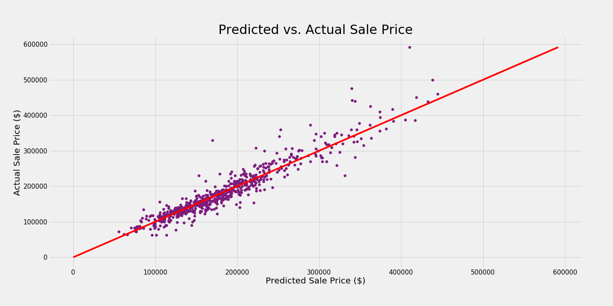

# Project 2 - Linear Regression Models on Ames Housing Data 
---
## Problem Statement:

**According to the Ames, Iowa housing data, which regression model can most accurately predict a house's price? As a result, why should millenials choose to live in Ames based on the most important housing features determined by the optimal regression model?**

[The Ames Iowa Housing Data](http://jse.amstat.org/v19n3/decock/DataDocumentation.txt) contains 81 housing variables that were used in computing assessed values for individual residential properties sold from 2006 to 2010. I will be using various regression models, such as Linear Regression, LassoCV, and RidgeCV, to determine which model most accurately fits the data by comparing RMSE and $R^2$ scores.

Furthermore, I believe Ames is a prime location for millenials based on the regression coefficients as well as many other factors.

[(Source: Trulia)](https://www.trulia.com/real_estate/Ames-Iowa/)

[According to Trulia](https://www.trulia.com/real_estate/Ames-Iowa/), Ames Real Estate Market Overview states the following: the median homeowner is 31, around 44% of individuals are single, the median household income is around \\$56,000, and 67\% are college educated.

[Wikipedia](https://en.wikipedia.org/wiki/Ames,_Iowa) also mentions how Ames had a population of 66,498 in 2017, and Iowa State University is home to 36,321 students (Fall 2017), which make up approximately one half of the city's population. Based on the demographics and cheaper than the [mean](https://www.zillow.com/home-values/) (\\$226,300) housing prices, Ames is a location where millenials should settle down in while also taking advantage of the housing market.

---
## Data Dictionary:

Please click the [following](http://jse.amstat.org/v19n3/decock/DataDocumentation.txt) for the Data Dictionary.

## Conclusions and Recommendations
---

**According to the Ames, Iowa housing data, which regression model can most accurately predict a house's price?**

The following table summarizes the metrics from different regression models in the following order:
Multiple Linear Regression with a variance threshold of 0.01, Multiple Linear Regression with a variance threshold of 0.05, Ridge Regression with a variance threshold of 0.01, and Lasso Regression with a variance threshold of 0.01.

| Metric | VT (0.01) | VT (0.05) | Ridge VT(0.01) | Lasso VT(0.01) |
|---|---|---|---|---|
| Mean Absolute Error | 17525 | 17436 | 16053 |  15966 | 
| Median Absolute Error | 12403 | 12688 | 10675 |11489 |
| Root Mean Squared Error | 25249 | 25835 | 24096 | 24356 |
| R2 | 0.892 | 0.887 | 0.901 |0.900 | 
| # of  Predictor Variables | 216 | 128 | 216 |  72 |
    
Based on the lasso model's metrics, it has the lowest MAE score and number of predictor variables, while having the second lowest MedAE and RMSE scores, and the second highest $R^2$ score.

**Based on the lasso's RMSE score, the lasso model can predict a house's price ± $24,356.**

Due to the substantially lower number of predictor variables along with its close metric scores compared to the ridge model, I believe the lasso model is the best model.

---

**As a result, why should millenials choose to live in Ames based on the most important housing features determined by the optimal regression model?**

Since I have decided that the Lasso model is the optimal model, the most important housing features are the following, from most to least important:

1. The ground living area in square feet
2. The house's overall quality
3. Whether the house is in Northridge Heights neighborhood
4. Whether the kitchen quality is excellent
- How many cars a garage can fit
- Whether the basement quality is excellent
- Whether the house is in Northridge neighborhood
- Whether the house is in Stone Brook neighborhood
- How many full basement bathrooms there are
- If the basement has good exposure to a walkout or garden wall.

The predictor variables that influence a houses' price are:

| Feature | Weight |
| --- | --- |
| Gr_Liv_Area | 1.97e+04 |
| Overall_Qual | 1.49e+04 |
| Neighborhood_NridgHt | 8.19e+03 |
| Kitchen_Qual_Ex | 7.75e+03 |
| Garage_Cars | 6.82e+03 |
| Bsmt_Qual_Ex | 6.36e+03 |
| Neighborhood_NoRidge | 5.63e+03 |
| Neighborhood_StoneBr | 5.27e+03 |
| Bsmt_Full_Bath | 4.93e+03 |
| Bsmt_Exposure_Gd | 4.62e+03 |
| Bldg_Type_1Fam | 4.15e+03 |
| Exter_Qual_Ex | 4.08e+03 |
| Overall_Cond | 3.81e+03 |
| Full_Bath | 3.61e+03 |
| Year_Built | 3.32e+03 |
| Screen_Porch | 3.24e+03 |
| Neighborhood_Crawfor | 3.21e+03 |
| MS_SubClass_a | 2.95e+03 |
| Sale_Type_New | 2.94e+03 |
| Exterior_1st_BrkFace | 2.28e+03 |
| Fireplaces | 2.27e+03 |
| Neighborhood_Somerst | 2.08e+03 |
| Lot_Config_CulDSac | 1.87e+03 |
| Wood_Deck_SF | 1.82e+03 |
| Year_Remod/Add | 1.68e+03 |
| Condition_1_Norm | 1.55e+03 |
| Land_Contour_HLS | 1.34e+03 |
| Heating_QC_Ex | 1.24e+03 |
| BsmtFin_Type_1_GLQ | 1.22e+03 |
| Lot_Area | 1.16e+03 |
| Lot_Shape_IR2 | 9.83e+02 |
| Total_Bsmt_SF | 9.79e+02 |
| Functional_Typ | 8.72e+02 |
| Garage_Finish_Fin | 8.55e+02 |
| Bsmt_Exposure_Av | 8.41e+02 |
| Paved_Drive_Y | 7.73e+02 |
| Mas_Vnr_Area | 7.26e+02 |
| Foundation_PConc | 7.25e+02 |
| Roof_Style_Hip | 7.24e+02 |
| Land_Contour_Low | 7.18e+02 |
| Exterior_2nd_VinylSd | 6.47e+02 |
| TotRms_AbvGrd | 6.46e+02 |
| Land_Slope_Mod | 5.56e+02 |
| Fireplace_Qu_Ex | 5.53e+02 |
| Misc_Feature_NA | 4.95e+02 |
| Neighborhood_ClearCr | 4.03e+02 |
| Half_Bath | 1.65e+02 |
| Foundation_Slab | -8.56e+01 |
| Bldg_Type_Twnhs | -9.20e+01 |
| Kitchen_AbvGr | -1.23e+02 |
| Neighborhood_OldTown | -1.28e+02 |
| Garage_Type_Detchd | -1.51e+02 |
| Heating_QC_TA | -2.33e+02 |
| Garage_Type_Basment | -2.46e+02 |
| MS_SubClass_g | -2.84e+02 |
| MS_Zoning_C (all) | -3.42e+02 |
| MS_SubClass_n | -3.48e+02 |
| Condition_1_RRAe | -3.92e+02 |
| Sale_Type_COD | -5.48e+02 |
| Bsmt_Exposure_No | -5.91e+02 |
| Exterior_2nd_Stucco | -6.24e+02 |
| Exterior_1st_HdBoard | -7.54e+02 |
| Pool_Area | -8.38e+02 |
| Bldg_Type_TwnhsE | -8.61e+02 |
| Fireplace_Qu_NA | -8.82e+02 |
| Exterior_1st_Stucco | -1.22e+03 |
| MS_Zoning_RM | -1.32e+03 |
| Exter_Qual_TA | -1.58e+03 |
| Kitchen_Qual_TA | -1.76e+03 |
| BsmtFin_Type_1_Unf | -2.06e+03 |
| Neighborhood_Edwards | -2.28e+03 |
| Land_Contour_Bnk | -2.60e+03 |

While holding all other variables constant, if there is a one unit standard deviation increase in `Gr_Liv_Area`, then the `SalePrice` will increase by ~20000 standard deviations. The same process of interpretation can be applied for all other predictor variables and their coefficients.

According to what [millenials want](https://www.newhomesource.com/guide/articles/what-millennials-want-in-a-new-home),  66 percent prefer the suburbs, and 75 percent prefer a single-family home to a condo or apartment because they do not want to share walls. The top neighborhoods, Northridge Heights, Northridge, and Stonebrook, are all located in the suburbs. 

Millenials also prefer larger living spaces and kitchens for three reasons:

1. [Relationships:](https://www.vivint.com/resources/article/what-millennials-want-home) Millenials value relationships and friendships, so larger living spaces are ideal to host parties for friends and families.
2. Millenials prefer good quality kitchens in an open space where it can easily transition into the TV room or living room. Open space fosters more communication.
3. [Dogs:](https://www.prnewswire.com/news-releases/suntrust-survey-mortgages-are-going-to-the-dogs-300493476.html) 33 percent of millenials who purchased their first home say the desire to have a better space or yard for a dog influenced their decision to purchase their first home.

Millenials also want [energy efficient homes](https://www.ecowatch.com/millennials-climate-change-2482557556.html) because climate change is a global issue in which 78 percent of respondents to the Global Shaper Survey of over 31,000 millenials said they are willing to change their lifestyle to protect the environment. Ames accomodates this need as Ames prides itself as being a progressive green city, evidenced by their construction of a [$75-million water treatment plant](https://www.cityofames.org/about-ames/about-ames), and the Ames Power Plant has converted from coal-produced electricity to cleaner natural gas.

As millenials understand that the most important qualities in the house (determined by the lasso model) cater towards their needs, they can be reassured that the homes in Ames, Iowa are the perfect fit.

## Next Steps
---
I should have utilized `GridSearchCV` in order to streamline my model fitting processes and to find optimal hyperparameters for my models. Furthermore, I would have used an `ElasticNet` regression model to see if my lasso model was too harshly penalizing the parameter coefficients. Pickling dataframes would have also streamlined the process and improved workflow efficiency.